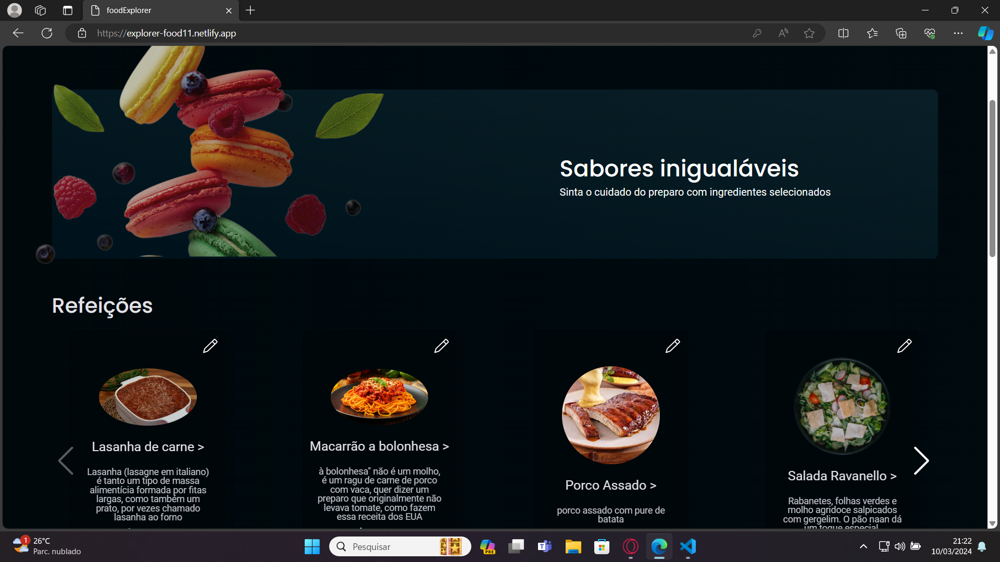

<h1 align="center" style="text-align: center;">
  
  Food Explorer
</h1>

> Cardápio digital para um restaurante fictício

<p align="center">
  <a href="#project">Projeto</a>&nbsp;&nbsp;&nbsp;|&nbsp;&nbsp;&nbsp;
  <a href="#structure">Estrutura</a>&nbsp;&nbsp;&nbsp;|&nbsp;&nbsp;&nbsp;
  <a href="#technologies">Tecnologias</a>&nbsp;&nbsp;&nbsp;|&nbsp;&nbsp;&nbsp;
  <a href="#usage">Utilização</a>&nbsp;&nbsp;&nbsp;|&nbsp;&nbsp;&nbsp;
  <a href="#license">Licença</a>
</p>

<p align="center">
  
</p>

<h2 id="project">📁 Projeto</h2>

<h3> - Imagem do projeto 😁 </h3>

<p align="center">
  
</p>

O projeto Food Explorer consiste no desafio final do programa Explorer da Rocketseat. Trata-se de uma aplicação de cardápio digital para um restaurante fictício.

O back-end do projeto, que lida com a lógica e o armazenamento dos dados, está disponível neste repositório. Já o front-end, responsável pela interface do usuário, está disponível [aqui](https://github.com/jadersonfarias/foodExplorerFrontEnd).

<h2 id="structure">📌 Estrutura</h2>

O projeto conta com as seguintes tabelas:

- Usuários
- Pratos
- Ingredientes dos pratos

<h2 id="technologies">💻 Tecnologias</h2>

Este projeto foi desenvolvido com as seguintes tecnologias:

- Bcrypt.js
- CORS
- Dotenv
- Express.js
- express-async-errors
- JSON Web Token
- Knex.js
- Node.js
- Multer
- PM2
- SQLite
- SQLite3

<h2 id="usage">💡 Utilização</h2>

O back-end do projeto está hospedado no endereçohttps://foodexplorerbackend-p5cx.onrender.com A aplicação Food Explorer está disponível para uso [aqui](https://foodexplorerbackend-p5cx.onrender.com).

⚠️ **Importante**: Este projeto utiliza uma hospedagem gratuita para o back-end, portanto, pode haver atrasos no tempo de resposta do servidor.

Você também pode executá-lo em sua máquina localmente. Certifique-se de ter o ``Node.js`` e o ``npm`` instalados antes de prosseguir com as etapas abaixo:

1. Clone o projeto:

```
$ git clone https://github.com/jadersonfarias/foodExplorerBackEnd
```

2. Acesse a pasta do projeto:

```
$ cd foodExplorerBackEnd
```

3. Instale as dependências:

```
$ npm i
```

4. Inicie o servidor:

```
$ npm start
```

⚠️ **Importante**: Crie um arquivo .env de acordo com o arquivo .env.example e preencha os campos AUTH_SECRET e PORT com suas respectivas informações.

- Para gerar o valor para o campo AUTH_SECRET, você pode utilizar o MD5 Hash Generator para gerar uma sequência de caracteres segura

- Preencha o campo PORT com o número da porta desejada para executar o servidor da aplicação

<h2 id="license">📝 Licença</h2>

Este projeto está sob a licença MIT.


<div style="display: flex;">
 <a href="https://www.linkedin.com/in/jaderson-farias/" target="_blank"></a>
  <a href="mailto:jader375@gmail.com"></a>
</div>

  
